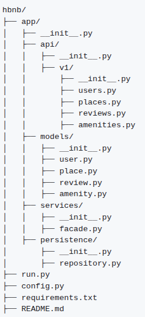

# HBnB API
## Project Overview

HBnB is a modular RESTful API built with Flask. The project follows a clean, layered architecture that separates concerns between the API layer, business logic, service layer (Facade pattern), and persistence layer.

The application currently uses an in-memory repository for data storage, which is designed to be replaced later with a database-backed solution such as SQLAlchemy without modifying the upper layers of the application.

## Project Structure

## Directory and File Description
### app/

Contains the core application logic.

### app/api/

Handles the presentation layer (API endpoints).
The v1/ directory organizes endpoints by API version.

 - users.py – User endpoints
 - places.py – Place endpoints
 - reviews.py – Review endpoints
 -  amenities.py – Amenity endpoints

### app/models/

Contains business logic and domain models:
 - user.py – User model
 - place.py – Place model
 - review.py – Review model
 - amenity.py – Amenity model

### app/services/

Implements the Facade Pattern.
 - facade.py – Contains the HBnBFacade class
 - Coordinates communication between API, models, and persistence layers
 - A singleton facade instance is created for global use

### app/persistence/

Handles data storage.

repository.py – Defines:
 - Repository (Abstract Base Class)
 - InMemoryRepository (current implementation)

This layer is designed to later support a database-backed repository.

### run.py

Application entry point.
Creates and runs the Flask application.

### config.py

Contains configuration classes for managing environment-specific settings.

### requirements.txt

Lists all required Python dependencies.

## Installation Instructions
1. Clone the Repository
    git clone <repository_url>
    cd hbnb
2. Create a Virtual Environment
    python3 -m venv venv

### Activate the virtual environment:

Linux / macOS
    source venv/bin/activate

Windows
    venv\Scripts\activate

3. Install Dependencies
    pip install -r requirements.txt

4. Run the Application
    python run.py

The application will start in development mode.

Swagger API documentation will be available at:

http://127.0.0.1:5000/api/v1/

## Author

Aythan and Vincent C#28-Sens
